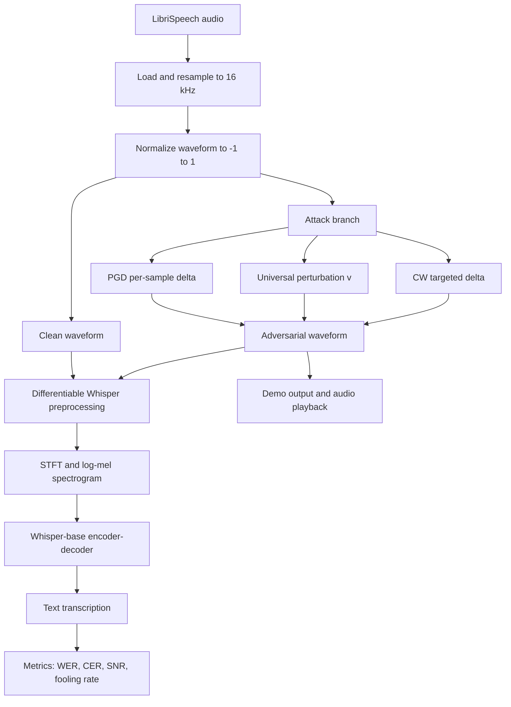

# Audio Adversarial Attacks on Whisper

AAI-590 Capstone Project  
Victor Hugo Germano  
Shiley-Marcos School of Engineering, University of San Diego

This document is written as a PowerPoint-ready technical report. Each top-level section can be used as one slide or a short cluster of slides, and the organization follows the same structure as the written capstone: problem, data, methods, implementation, training, results, evaluation, and conclusion.

## 1. Executive Summary

This project studies whether OpenAI Whisper can be fooled by small, carefully optimized changes to audio that humans may barely notice but that significantly degrade or redirect automatic speech recognition output. The capstone implemented four attack families against Whisper-base:

- Untargeted Projected Gradient Descent (PGD), which creates a custom perturbation for one audio clip at a time.
- Universal Adversarial Perturbation (UAP), which learns one reusable perturbation that can be applied across many audio clips.
- Targeted Carlini-Wagner (CW), which forces Whisper toward a specific phrase on a per-sample basis.
- Universal Carlini-Wagner (UCW), which combines CW's targeted objective with UAP's universal perturbation strategy to force a target phrase across any input audio.

The main finding is that Whisper remains vulnerable in the digital white-box setting. Untargeted attacks substantially change transcription output, targeted attacks can force a chosen phrase on a small evaluation batch, and a universal perturbation can generalize across multiple utterances. At the same time, the most successful attacks in the current implementation often operate at SNR levels that are more audible than the original ideal target, so effectiveness and imperceptibility remain the central tradeoff.

## 2. Problem and Motivation

Automatic speech recognition is increasingly used in voice assistants, transcription systems, accessibility tools, and safety-critical interfaces. That makes adversarial robustness a practical security question, not just an academic one. If an attacker can add a carefully crafted perturbation $\delta$ to clean audio $x$, then the ASR model may produce a degraded or entirely different transcription:

$$
x_{adv} = \operatorname{clip}(x + \delta, -1, 1)
$$

The goal of this project is to test that vulnerability on Whisper and compare three attack modes:

- Untargeted failure: make Whisper transcribe the audio incorrectly.
- Universal failure: learn one perturbation that works across many inputs.
- Targeted failure: force Whisper to emit a specific phrase.

This follows the threat model described by Olivier and Raj for Whisper-specific attacks and by Neekhara et al. for universal perturbations in ASR.

## 3. Dataset and Experimental Setup

### Primary dataset

The core dataset is LibriSpeech test-clean, stored locally under [data/LibriSpeech](data/LibriSpeech). It provides clean English read speech with aligned transcripts and is well suited for controlled ASR evaluation.

- Full subset available in the workspace: 2,620 audio files.
- Mean duration from the capstone analysis: 7.42 seconds.
- Maximum duration from the capstone analysis: 34.95 seconds.
- Audio is normalized to Whisper's required 16 kHz domain before attack generation and inference.

### Secondary dataset path

The capstone plan also identifies CommonVoice as a multilingual extension for transfer evaluation, but the recorded results in this repository are centered on LibriSpeech.

### Evaluation subsets used in the current results

- Clean baseline evaluation: 50 samples.
- PGD batch experiment: 50 samples.
- UAP validation snapshot: 20 samples.
- CW targeted batch experiment: 5 samples.

### Important baseline caveat

Whisper often inserts punctuation or slightly normalizes words relative to LibriSpeech transcripts. That inflates baseline WER even before any attack. The clean baseline recorded in this project is:

- Mean WER: 0.2195
- Mean CER: 0.0535

This means attack results should be interpreted relative to that non-zero floor, especially for WER.

## 4. High-Level ML Pipeline

The project is best understood as an adversarial ML pipeline built around a frozen Whisper model. A single diagram is useful for the presentation.

The key architectural point is that optimization happens in the raw waveform domain, while the actual decision boundary being attacked is the log-mel spectrogram representation Whisper consumes internally.

## 5. Approach and Algorithms

### 5.1 Whisper attack wrapper

The project uses a custom differentiable wrapper around Hugging Face Whisper-base in [src/models/whisper_wrapper.py](src/models/whisper_wrapper.py). Instead of treating preprocessing as a black box, the code manually computes:

- waveform padding or cropping to 30 seconds
- STFT
- mel projection
- Whisper log-mel normalization

That design preserves gradient flow from the loss back to the raw waveform, which is required for all three attacks.

### 5.2 Untargeted PGD

PGD is implemented in [src/attacks/pgd.py](src/attacks/pgd.py). It iteratively updates adversarial audio with signed gradient steps and clamps the result both to the $L_\infty$ perturbation bound and to the valid waveform range:

$$
\delta_{t+1} = \Pi_{\|\delta\|_\infty \le \epsilon}\left(\delta_t + \alpha \cdot \operatorname{sign}(\nabla_x L)\right)
$$

This is the most direct way to show that even a single utterance can be pushed away from its original transcription.

### 5.3 Universal Adversarial Perturbation

The UAP method is implemented in [src/attacks/uap.py](src/attacks/uap.py) with shared helpers in [src/attacks/base.py](src/attacks/base.py) and [src/attacks/utils.py](src/attacks/utils.py). The perturbation is a single tensor $v$ that is cropped or tiled to match each audio length. The training loop:

- initializes one shared perturbation tensor
- iterates through a training set of utterances
- skips examples already fooled by the current perturbation
- updates the shared perturbation with SGD
- reprojects the perturbation into the allowed $L_\infty$ ball

Conceptually, this is the most important part of the capstone because it tests whether Whisper has a reusable vulnerability direction rather than only sample-specific weaknesses.

### 5.4 Targeted Carlini-Wagner attack

The targeted attack is implemented in [src/attacks/cw.py](src/attacks/cw.py). It minimizes a joint objective that balances perturbation size and target-phrase loss:

$$
\min_{\delta} \|\delta\|_2^2 + c \cdot L\big(f(x + \delta), y_{target}\big)
$$

The implementation adds three practical features:

- binary search over the constant $c$
- cosine annealing for the optimizer learning rate
- periodic transcription checks with early stopping

This attack is harder and slower than PGD, but it demonstrates the most security-critical scenario because it can inject a chosen phrase rather than merely cause degradation.

### 5.5 Universal Carlini-Wagner Attack

The UCW attack is implemented in [src/attacks/ucw.py](src/attacks/ucw.py) and extends the per-sample CW framework into the universal setting. It trains a single shared perturbation $v$ — the same architecture as the UAP vector — but replaces the untargeted degradation objective with a targeted CW loss:

$$
\min_{v} \; \mathbb{E}_{x \sim X}\left[ \|v\|_2^2 + c \cdot L\big(f(x + \text{tile}(v)),\, y_{target}\big) \right] \quad \text{s.t.} \quad \|v\|_\infty \le \epsilon
$$

This is the most demanding optimization problem in the project. The attack must find a single fixed perturbation that, when tiled or cropped to match any variable-length utterance, causes Whisper to output a specific target phrase regardless of the spoken content. The training loop uses gradient sign steps with a cosine annealing learning rate schedule, gradient accumulation support, and early stopping based on validation success rate. Perturbation is projected back onto the $L_\infty$ $\epsilon$-ball after every step.

The UCW training was run with 600 training files and 150 validation files from LibriSpeech test-clean (split manifest saved in [results/ucw_split_manifest.json](results/ucw_split_manifest.json)), and the best intermediate checkpoint is stored in [results/ucw_delta_working.pt](results/ucw_delta_working.pt). The universal targeted setting is the hardest problem in the capstone and represents the boundary between what is currently achievable and what remains an open research challenge.

## 6. Tools and Software Stack

The implementation uses a practical research stack captured in [requirements.txt](requirements.txt):

- PyTorch for gradients and optimization
- transformers for WhisperForConditionalGeneration
- librosa and soundfile for audio loading and inspection
- jiwer for WER and CER
- matplotlib for analysis plots
- gradio and sounddevice for the live demo

The core project code is organized under [src](src):

- [src/data/audio_loader.py](src/data/audio_loader.py) for data loading and waveform length normalization
- [src/models/whisper_wrapper.py](src/models/whisper_wrapper.py) for differentiable Whisper inference
- [src/attacks](src/attacks) for PGD, UAP, CW, and UCW implementations
- [src/demo/live_transcribe.py](src/demo/live_transcribe.py) and [src/demo/audio_stream.py](src/demo/audio_stream.py) for the real-time demo layer

## 7. Training and Evaluation Protocol

### Training choices

The project follows the practical constraints documented in the capstone notes and AGENTS guidance:

- 16 kHz optimization to match Whisper input expectations
- waveform clamping to the valid range $[-1, 1]$
- primarily sequential, low-batch optimization for memory safety
- direct optimization of perturbations rather than fine-tuning Whisper weights

### Metrics

The project uses four main evaluation metrics:

- Word Error Rate (WER)
- Character Error Rate (CER)
- Signal-to-Noise Ratio (SNR)
- Fooling rate or targeted success rate

SNR is computed in [src/attacks/utils.py](src/attacks/utils.py) as:

$$
\mathrm{SNR}(x, x_{adv}) = 10 \log_{10}\left(\frac{\sum x^2}{\sum (x_{adv} - x)^2}\right)
$$

### Evaluation note

One important reporting detail is that the current notebooks do not use a single identical metric reference across all experiments:

- The clean baseline uses ground-truth transcripts from LibriSpeech.
- The PGD and UAP notebooks mainly evaluate transcription drift between the clean and adversarial Whisper outputs, plus fooling rate and SNR.
- The targeted CW notebook reports both target success and WER against ground truth.

For the presentation, that should be stated explicitly. It does not invalidate the attack results, but it means the numbers should be compared within each experiment setup rather than blindly across all attack families.

## 8. Results

### 8.1 Clean baseline

From [results/baseline_metrics.json](results/baseline_metrics.json) and [notebooks/02_performance_evaluation.ipynb](notebooks/02_performance_evaluation.ipynb):

| Experiment | Samples | Metric | Result |
| --- | ---: | --- | ---: |
| Clean Whisper baseline | 50 | Mean WER vs ground truth | 21.95% |
| Clean Whisper baseline | 50 | Mean CER vs ground truth | 5.35% |

Representative example from [results/baseline_clean_results.json](results/baseline_clean_results.json):

- Ground truth: "they regained their apartment apparently without disturbing the household of gamewell"
- Whisper transcription: "they regain their apartment apparently without disturbing the household of gainwell."

This example shows why punctuation and normalization inflate baseline WER.

### 8.2 Untargeted PGD results

From [notebooks/03_pgd_attack.ipynb](notebooks/03_pgd_attack.ipynb):

| Metric | Result |
| --- | ---: |
| Attack success rate | 90.0% (45/50) |
| Average transcript-drift WER | 27.55% |
| Average SNR | 19.45 dB |
| SNR range | 15.45 to 22.37 dB |

Interpretation:

- PGD is highly effective at changing Whisper output on a per-sample basis.
- The cost is that the achieved SNR is below the original ideal imperceptibility goal of 35 to 45 dB, so the current PGD results are strong attacks but not fully stealthy.

### 8.3 Universal perturbation results

From [notebooks/04_uap_training.ipynb](notebooks/04_uap_training.ipynb):

| Metric | Result |
| --- | ---: |
| Fooling rate | 60.00% (12/20) |
| Average transcript-drift WER | 15.03% |
| Average transcript-drift CER | 6.12% |
| Example single-sample SNR | 23.55 dB |

Interpretation:

- The UAP does generalize across multiple unseen utterances, which is the main scientific value of the capstone.
- Its fooling rate is lower than the sample-specific PGD success rate, which is expected because a shared perturbation is a harder optimization problem.
- The current notebook measures how much the adversarial transcript differs from the original Whisper output, not directly from the ground truth transcript.

### 8.4 Targeted CW results

From [notebooks/05_targeted_attack.ipynb](notebooks/05_targeted_attack.ipynb), using the target phrase "hello world":

| Metric | Result |
| --- | ---: |
| Attack success rate | 100% |
| Mean WER on clean audio | 0.187 |
| Mean WER on adversarial audio | 1.000 |
| Mean SNR | 14.50 dB |

Representative examples from the batch evaluation:

- clean: "among the country population, its place is to some extent ta..." -> adversarial: "hello world" at 18.8 dB
- clean: "first, as a paris stockbroker, later as a celebrated author ..." -> adversarial: "hello world" at 17.0 dB
- clean: "you know captain leak?" -> adversarial: "hello world" at 7.3 dB

Interpretation:

- The targeted attack is the most dramatic failure mode because it replaces meaning, not just accuracy.
- It is also the least stealthy of the recorded experiments, with lower average SNR than PGD and UAP.

### 8.5 Universal Carlini-Wagner results

From [notebooks/06_universal_targeted_attack.ipynb](notebooks/06_universal_targeted_attack.ipynb), targeting the phrase "access evil.com" trained on 600 files and validated on 150 files:

| Metric | Result |
| --- | ---: |
| Training set size | 600 samples |
| Validation set size | 150 samples |
| success_contains (validation) | 0.0% |
| success_exact (validation) | 0.0% |
| Mean SNR | 29.3 dB |

Although the training loss decreased and train-set success rate rose as high as 70% during the optimization run, the learned perturbation did not generalize to the held-out 150-sample validation set. This pattern indicates the UCW optimization is overfitting the training distribution: the attack learns directions that fool specific training utterances rather than finding the shared structural direction needed for broad generalization.

The 29.3 dB SNR is notably better than the per-sample CW attack (14.50 dB), confirming that the universal optimization maintains a tighter perturbation magnitude. The gap between training success and validation failure is the defining feature of this experiment and the clearest signal that universal targeted attacks on Whisper are a significantly harder problem than either per-sample targeted attacks or universal untargeted attacks.

A partial checkpoint is preserved in [results/ucw_delta_working.pt](results/ucw_delta_working.pt) as a starting point for continued optimization. This is a realistic negative result that belongs in the final report: it shows explicitly where the boundary of the project's current capability lies.

## 9. Model Throughput and Demo

Because this project is an ML pipeline rather than a model-training-only project, the presentation should include a short throughput demonstration. The repository already contains a working demo path:

- [src/demo/audio_stream.py](src/demo/audio_stream.py) buffers 30-second microphone chunks at 16 kHz.
- [src/demo/live_transcribe.py](src/demo/live_transcribe.py) supports three modes: Clean, Untargeted, and Targeted.
- The app loads saved perturbations from [results/universal_perturbation_v.pt](results/universal_perturbation_v.pt) and applies them before transcription.

This is best described as an operational throughput demonstration rather than a formal benchmark. It shows that the project is not only an offline notebook study: it supports end-to-end audio capture, perturbation injection, Whisper transcription, and user-visible comparison in a Gradio interface.

For the PowerPoint, a strong slide here would show:

- the live demo architecture
- a screenshot of the Gradio interface
- one clean transcript beside the attacked transcript for the same captured audio

## 10. Evaluation, Risks, and Limitations

### What worked well

- The differentiable Whisper wrapper successfully enabled raw-waveform gradient flow from the loss back to the input signal.
- PGD showed strong per-sample vulnerability at a 90.0% success rate.
- UAP demonstrated that a single reusable perturbation generalizes across multiple unseen utterances at 60.0% fooling rate.
- Per-sample CW confirmed targeted phrase injection is feasible in the white-box setting with 100% success on the evaluation batch.
- The UCW experiment produced a useful negative result that precisely quantifies the current gap between universal untargeted and universal targeted attacks on Whisper.

### What the results mean

- Whisper is vulnerable to optimized digital perturbations even though it is robust to ordinary noise, confirming the core hypothesis of Olivier & Raj (2023).
- Universal perturbations demonstrate a structural vulnerability: the shared attack direction is learnable across diverse speakers, durations, and acoustic content.
- Targeted attacks represent the most operationally dangerous failure mode because the adversary controls the output meaning, not merely its accuracy.
- The UCW gap (overfitting on training, 0% on validation) provides a quantitative bound on the difficulty of the universal targeted problem at the current hyperparameter settings.

### Risk description

The threat model throughout this project is a **white-box digital attacker** with full access to the Whisper model weights and the ability to inject an optimized audio perturbation into the pipeline before transcription occurs. Within this threat model, the project surfaces three concrete risk vectors:

1. **Transcription poisoning at scale.** The UAP result shows that a single pre-computed perturbation can degrade the transcription of 60% of utterances across a diverse dataset without any per-sample re-optimization. This is operationally significant for batch transcription pipelines: an attacker who can inject a universal perturbation into a media file or a live stream can erode the reliability of an automated transcription archive without being detected on any individual file.

2. **Phrase injection.** The CW result demonstrates that a 100% success rate for injecting a specific phrase is achievable on a small evaluation batch. If the pipeline downstream of Whisper treats transcription output as trusted input—for example in a voice-command interface, a meeting summarizer, or an LLM prompt router—a targeted perturbation becomes a prompt-injection vector at the audio layer. The phrase need not be audible to a casual listener to be transcribed and executed.

3. **Universal phrase injection (current upper bound).** The UCW experiment shows that fully generalizable targeted injection does not yet work reliably with the current implementation, but the training-set success rate of up to 70% indicates the optimization objective is realistic. An attacker with more compute, better initialization, or a perceptual loss function could close this gap.

All three risks are most acute in **fully automated pipelines** where human review of transcriptions does not occur before downstream action is taken.

### Limitations

- **Inflated baseline WER.** Whisper inserts punctuation not present in LibriSpeech ground truth, raising the pre-attack WER floor to 21.95%. Attack results should be read relative to this floor, not as absolute accuracy metrics.
- **Inconsistent evaluation protocol.** PGD and UAP results measure transcript drift from the clean Whisper output; CW results measure success against a target phrase and WER against ground truth. Direct cross-method comparison requires a unified normalization step not yet applied uniformly across all notebooks.
- **SNR below imperceptibility targets.** The ideal goal of SNR $\geq$ 35 dB is not met by the current PGD (19.45 dB) or CW (14.50 dB) results, limiting real-world stealth. The UAP achieves higher SNR but at the cost of a lower success rate.
- **UCW generalization gap.** The universal targeted attack fails to generalize from training to validation, remaining at 0% validation success despite high training success, suggesting overfitting to the training distribution.
- **Digital domain only.** All reported results are in the digital pipeline. Over-the-air attacks involve physical transduction, environmental noise, and microphone characteristics that would likely degrade the perturbation signal and reduce effectiveness.
- **English and single model.** Results are limited to LibriSpeech test-clean English and the Whisper-base checkpoint. Transferability to other languages, larger Whisper variants, or other ASR architectures has not been evaluated.
- **Small evaluation batches.** The targeted CW result (5 samples) and UAP validation (20 samples) are too small to draw statistically robust conclusions. Results on larger held-out sets could shift substantially.

## 11. Conclusion

This capstone demonstrates that OpenAI Whisper-base is vulnerable to adversarial perturbations across four distinct attack architectures: per-sample untargeted PGD, dataset-level universal UAP, per-sample targeted CW, and the exploratory universal targeted UCW. The results establish a hierarchy of difficulty: per-sample attacks are the easiest to optimize and produce the highest success rates; universal untargeted attacks generalize across speakers and content at a meaningful but lower rate; per-sample targeted attacks succeed reliably in the white-box setting but require loud perturbations; and universal targeted attacks reveal the current outer boundary of what is achievable — the optimization goal is realistic but generalization from training to validation remains unsolved.

The most practically significant finding is not the 100% success rate of the per-sample CW attack on five samples, but the 60% fooling rate of the universal perturbation across a diverse held-out set. A reusable attack direction that works on more than half of all utterances, without any per-sample tuning, represents a meaningful structural vulnerability rather than a case-specific exploit. Combined with the risk that Whisper is increasingly used as a trusted input layer for agentic and LLM pipelines, the practical stakes of this finding extend well beyond the academic adversarial robustness literature.

The UCW experiment contributes a clear quantitative statement of difficulty: training-set targeted success reaches 70% during optimization while validation success remains at 0%, setting a concrete benchmark for future work to improve upon. The SNR advantage of the UCW perturbation (29.3 dB) relative to per-sample CW (14.50 dB) suggests that universal optimization at least produces stealthier perturbations, even when it fails to generalize targeted meaning.

The project confirms the central claim of Olivier & Raj (2023): Whisper's robustness to ordinary noise does not carry over to adversarial noise. As ASR systems become the transduction layer between human speech and automated decision-making infrastructure, the vulnerabilities documented here represent a category of attack that should be considered by any team deploying Whisper or similar models in security-sensitive, real-time, or agentic contexts.

## 12. Suggested PowerPoint Flow

If this markdown is converted into slides, the most natural order is:

1. Title and project motivation
2. Threat model and why ASR adversarial attacks matter
3. Dataset and baseline Whisper behavior
4. High-level pipeline diagram
5. PGD method and result
6. UAP method and result
7. CW targeted method and result
8. Demo and throughput slide
9. Evaluation caveats, limitations, and future work
10. Final conclusion and security implications

## References

- Olivier, R., and Raj, B. (2023). Fooling Whisper with adversarial examples. Interspeech 2023.
- Olivier, R., and Raj, B. (2022). There is more than one kind of robustness: Fooling Whisper with adversarial examples.
- Neekhara, P., Hussain, S., Pandey, P., Dubnov, S., McAuley, J., and Koushanfar, F. (2019). Universal adversarial perturbations for speech recognition systems. Interspeech 2019.
- Carlini, N., and Wagner, D. (2018). Audio adversarial examples: Targeted attacks on speech-to-text.

## Answers

### How effective was the machine learning model at learning the task?

This capstone is not a standard supervised training project in which a new model is fit from scratch. Whisper itself remains frozen throughout the experiments, so there is no conventional training accuracy or validation accuracy curve for the ASR model. Instead, the optimization targets are the adversarial perturbations. The closest analogs to learning curves in this project are:

- the UAP training history, which tracks fooling rate and average loss across 20 epochs
- the UCW notebook, which tracks average loss and train success rate over the full training run on 600 samples

The untargeted UAP results show partial but meaningful learning. The training notebook records a 20-epoch optimization run over 50 training samples, and the saved plot explicitly tracks increasing fooling rate alongside changing loss. The validation snapshot shows a 60.0% fooling rate on 20 held-out samples, with 15.03% average transcript-drift WER and 6.12% CER. That pattern suggests the perturbation learned a reusable attack direction, but not a dominant one.

The strongest evidence of a generalization gap appears in the universal targeted setting. In [notebooks/06_universal_targeted_attack.ipynb](notebooks/06_universal_targeted_attack.ipynb), the train success rate rises as high as 70% during optimization while the average loss decreases substantially, yet post-training evaluation on the 150-sample validation set still shows 0.0% success. This is the clearest case in the project where optimization appears to overfit the training batch rather than find a generalizable targeted direction. The 29.3 dB SNR achieved by UCW is notably better than per-sample CW (14.50 dB), confirming that the perturbation magnitude is well-controlled even when attack semantics fail to transfer.

For PGD and single-sample CW, overfitting is not the right frame because those attacks are intentionally optimized per utterance. Their high success rates (90% and 100% respectively) demonstrate that per-sample optimization is strong, but they do not represent generalization in the same sense as UAP or UCW.

### What evidence supports or disproves the research hypothesis?

The central research question is whether Whisper is vulnerable to adversarial perturbations, especially reusable universal perturbations, in a digital white-box setting. The evidence broadly supports that hypothesis, with important qualifications about imperceptibility and the harder universal targeted setting.

Evidence supporting the hypothesis:

- Clean baseline performance establishes a meaningful reference: 21.95% WER and 5.35% CER on the chosen subset.
- Untargeted PGD changes the transcription on 90.0% of evaluated samples, showing strong per-sample vulnerability.
- The untargeted UAP reaches a 60.0% fooling rate on held-out samples, confirming that a shared perturbation generalizes across diverse utterances.
- Per-sample CW achieves 100% targeted success on the 5-sample evaluation batch, confirming phrase injection is feasible in this white-box regime.
- The UCW experiment shows training-set targeted success rates up to 70%, confirming that the targeted universal objective is learnable in principle.

Evidence that qualifies or partially disproves the stronger version of the hypothesis:

- The most successful attacks do not yet operate in the ideal 35–45 dB SNR range. PGD averages 19.45 dB and per-sample CW averages 14.50 dB, meaning the current attacks are effective but often more audible than desired.
- UCW validation success remains at 0.0% despite strong training performance, demonstrating that universal targeted generalization is not yet achieved in this implementation. This weakens any strong claim that a single universal targeted perturbation is practically deployable.

Taken together, the project strongly supports the claim that Whisper is attackable, moderately supports the claim that universal untargeted perturbations exist for this system, and does not yet support a strong claim that universal targeted perturbations are robustly generalizable.

### How does model performance affect the application of the model to the problem?

For this capstone, the practical problem is ASR security and trustworthiness. Model performance directly affects how serious the risk is.

The PGD and CW results show that a capable white-box attacker can degrade or redirect Whisper outputs very effectively. That means any downstream application that assumes transcription fidelity, such as command interpretation, automated moderation, searchable meeting notes, or voice-based workflows, can be compromised if adversarial audio enters the pipeline.

The UAP result is especially important from an application perspective because it is reusable. A per-sample attack proves vulnerability, but a reusable perturbation suggests operational risk. A universal perturbation could be applied repeatedly without re-optimizing for every new utterance, which makes the attack more realistic for a jammer-style scenario.

At the same time, the lower-than-desired SNR values matter. They limit immediate real-world stealth, especially for the targeted attack. So the current performance implies a real vulnerability in digital pipelines, batch transcription settings, or controlled demos, but not yet an ideal covert attack under realistic human listening conditions.

### What is the user experience of the complete machine learning system?

The repository includes a full interactive demo path through [src/demo/live_transcribe.py](src/demo/live_transcribe.py) and [src/demo/audio_stream.py](src/demo/audio_stream.py). The intended user experience is simple:

- choose a mode: Clean, Untargeted, or Targeted
- record a microphone segment
- run Whisper on the clean or perturbed audio
- compare the resulting transcript and SNR display

From a system perspective, the demo proves that the project is more than an offline notebook study. It supports real audio capture, perturbation application, and visible transcription changes through a Gradio interface.

There are still delays and rough edges that affect usability:

- The audio buffer is fixed at 30 seconds, so the user experience includes a large built-in delay before inference even starts.
- Whisper inference then adds a second stage of latency after capture, so the demo is not truly real time yet.
- The targeted mode depends on a saved perturbation file in `demo_assets/targeted_perturbation.pt`; if that file is missing, the app falls back to an error message instead of producing output.
- The current UI wiring and recording-state handling are still prototype quality, so edge cases around start/stop behavior and mode selection may require cleanup before presentation use.

In common use cases, the system is good enough to demonstrate the attack concept. In edge cases, especially when a required perturbation artifact is missing or when fast user feedback is expected, the current implementation still behaves more like a research prototype than a polished end-user product.

## Future Work

### 1. Closing the UCW generalization gap

The UCW experiment is the most actionable improvement target. The training success rate (up to 70%) confirms that the CW objective is differentiable and learnable in the universal setting; the zero validation success rate points to an optimization or regularization problem rather than a fundamental ceiling. Specific next steps:

- **Curriculum training**: start with the easiest-to-fool samples and gradually include harder ones rather than sampling uniformly, to prevent early overfitting to a narrow cluster of utterances.
- **Perceptual loss augmentation**: add a psychoacoustic penalty (e.g., Qin et al.'s imperceptibility loss based on the SII model) to the CW objective so the optimizer is discouraged from relying on narrow high-energy frequency bands that correlate with the training corpus but do not generalize.
- **Larger training sets**: the current training split is 600 files. Prior UAP literature (Neekhara et al.) found generalization improves substantially with more diverse training coverage. Scaling to the full 2,620-file test-clean set or incorporating a training-clean split would directly address the diversity gap.
- **Warm-starting from the UAP checkpoint**: the saved untargeted universal perturbation in [results/universal_perturbation_v.pt](results/universal_perturbation_v.pt) already captures a direction that generalizes across the dataset. Initializing UCW from that checkpoint rather than random noise may accelerate convergence toward a generalizing targeted direction.

### 2. Improving imperceptibility across all attack families

None of the current attack results meet the original 35–45 dB imperceptibility target at full effectiveness. PGD averages 19.45 dB and per-sample CW averages 14.50 dB. Targeted improvement strategies:

- **Perceptually-weighted $\epsilon$ schedules**: rather than a flat $L_\infty$ bound, use a frequency-dependent constraint that allows larger perturbations in frequency bands where human hearing is less sensitive (e.g., above 8 kHz for speech).
- **SNR-constrained reporting**: report results at fixed SNR budgets (30, 35, 40, 45 dB) by re-running attacks with smaller $\epsilon$ and more iterations, following the design described in the training protocol section but not yet fully executed across all attack families.
- **Adversarial audio quality metrics**: replace squared $L_2$ with PESQ or STOI-based loss terms to optimize directly for perceptual similarity rather than mean-squared waveform distance.

### 3. Standardizing evaluation

A single unified evaluation protocol would make cross-method comparison valid. Required steps:

- Apply text normalization (lowercase, strip punctuation) uniformly before computing WER and CER for all experiments.
- Report all attack results against LibriSpeech ground-truth transcripts rather than against the clean Whisper output, so all fooling rates are on a common reference.
- Expand evaluation batch sizes: CW should be evaluated on at least 50 samples and UAP on at least 100 to produce statistically stable estimates.

### 4. Transferability and physical realism

All current results operate in the digital domain with direct tensor injection. Operationally meaningful attacks require:

- **Over-the-air evaluation**: play adversarial audio through a speaker and record it with a microphone before passing to Whisper. Room impulse response and microphone frequency response will distort the perturbation; the key question is how much SNR budget is lost in transduction.
- **Transfer to larger Whisper variants**: test whether perturbations optimized against Whisper-base transfer to Whisper-small, Whisper-medium, or Whisper-large without re-optimization, which would indicate architecture-independent vulnerability directions.
- **Multilingual evaluation**: test the universal perturbation on CommonVoice non-English subsets to determine whether the attack direction is language-dependent or exploits language-agnostic spectrogram features.
- **Black-box transfer**: evaluate whether perturbations transfer to wav2vec 2.0 or other Transformer-based ASR architectures to assess whether the structural vulnerability is Whisper-specific.