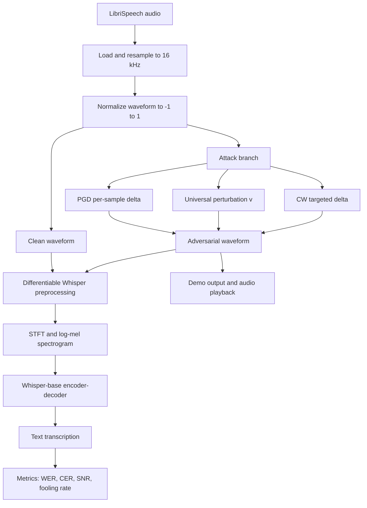

# Audio Adversarial Attacks on Whisper

AAI-590 Capstone Project  
Victor Hugo Germano  
Shiley-Marcos School of Engineering, University of San Diego

This document is written as a PowerPoint-ready technical report. Each top-level section can be used as one slide or a short cluster of slides, and the organization follows the same structure as the written capstone: problem, data, methods, implementation, training, results, evaluation, and conclusion.

## 1. Executive Summary

This project studies whether OpenAI Whisper can be fooled by small, carefully optimized changes to audio that humans may barely notice but that significantly degrade or redirect automatic speech recognition output. The capstone implemented three attack families against Whisper-base:

- Untargeted Projected Gradient Descent (PGD), which creates a custom perturbation for one audio clip at a time.
- Universal Adversarial Perturbation (UAP), which learns one reusable perturbation that can be applied across many audio clips.
- Targeted Carlini-Wagner (CW), which forces Whisper toward a specific phrase.

The main finding is that Whisper remains vulnerable in the digital white-box setting. Untargeted attacks substantially change transcription output, targeted attacks can force a chosen phrase on a small evaluation batch, and a universal perturbation can generalize across multiple utterances. At the same time, the most successful attacks in the current implementation often operate at SNR levels that are more audible than the original ideal target, so effectiveness and imperceptibility remain the central tradeoff.

## 2. Problem and Motivation

Automatic speech recognition is increasingly used in voice assistants, transcription systems, accessibility tools, and safety-critical interfaces. That makes adversarial robustness a practical security question, not just an academic one. If an attacker can add a carefully crafted perturbation $\delta$ to clean audio $x$, then the ASR model may produce a degraded or entirely different transcription:

$$
x_{adv} = \operatorname{clip}(x + \delta, -1, 1)
$$

The goal of this project is to test that vulnerability on Whisper and compare three attack modes:

- Untargeted failure: make Whisper transcribe the audio incorrectly.
- Universal failure: learn one perturbation that works across many inputs.
- Targeted failure: force Whisper to emit a specific phrase.

This follows the threat model described by Olivier and Raj for Whisper-specific attacks and by Neekhara et al. for universal perturbations in ASR.

## 3. Dataset and Experimental Setup

### Primary dataset

The core dataset is LibriSpeech test-clean, stored locally under [data/LibriSpeech](data/LibriSpeech). It provides clean English read speech with aligned transcripts and is well suited for controlled ASR evaluation.

- Full subset available in the workspace: 2,620 audio files.
- Mean duration from the capstone analysis: 7.42 seconds.
- Maximum duration from the capstone analysis: 34.95 seconds.
- Audio is normalized to Whisper's required 16 kHz domain before attack generation and inference.

### Secondary dataset path

The capstone plan also identifies CommonVoice as a multilingual extension for transfer evaluation, but the recorded results in this repository are centered on LibriSpeech.

### Evaluation subsets used in the current results

- Clean baseline evaluation: 50 samples.
- PGD batch experiment: 50 samples.
- UAP validation snapshot: 20 samples.
- CW targeted batch experiment: 5 samples.

### Important baseline caveat

Whisper often inserts punctuation or slightly normalizes words relative to LibriSpeech transcripts. That inflates baseline WER even before any attack. The clean baseline recorded in this project is:

- Mean WER: 0.2195
- Mean CER: 0.0535

This means attack results should be interpreted relative to that non-zero floor, especially for WER.

## 4. High-Level ML Pipeline

The project is best understood as an adversarial ML pipeline built around a frozen Whisper model. A single diagram is useful for the presentation.

The key architectural point is that optimization happens in the raw waveform domain, while the actual decision boundary being attacked is the log-mel spectrogram representation Whisper consumes internally.

## 5. Approach and Algorithms

### 5.1 Whisper attack wrapper

The project uses a custom differentiable wrapper around Hugging Face Whisper-base in [src/models/whisper_wrapper.py](src/models/whisper_wrapper.py). Instead of treating preprocessing as a black box, the code manually computes:

- waveform padding or cropping to 30 seconds
- STFT
- mel projection
- Whisper log-mel normalization

That design preserves gradient flow from the loss back to the raw waveform, which is required for all three attacks.

### 5.2 Untargeted PGD

PGD is implemented in [src/attacks/pgd.py](src/attacks/pgd.py). It iteratively updates adversarial audio with signed gradient steps and clamps the result both to the $L_\infty$ perturbation bound and to the valid waveform range:

$$
\delta_{t+1} = \Pi_{\|\delta\|_\infty \le \epsilon}\left(\delta_t + \alpha \cdot \operatorname{sign}(\nabla_x L)\right)
$$

This is the most direct way to show that even a single utterance can be pushed away from its original transcription.

### 5.3 Universal Adversarial Perturbation

The UAP method is implemented in [src/attacks/uap.py](src/attacks/uap.py) with shared helpers in [src/attacks/base.py](src/attacks/base.py) and [src/attacks/utils.py](src/attacks/utils.py). The perturbation is a single tensor $v$ that is cropped or tiled to match each audio length. The training loop:

- initializes one shared perturbation tensor
- iterates through a training set of utterances
- skips examples already fooled by the current perturbation
- updates the shared perturbation with SGD
- reprojects the perturbation into the allowed $L_\infty$ ball

Conceptually, this is the most important part of the capstone because it tests whether Whisper has a reusable vulnerability direction rather than only sample-specific weaknesses.

### 5.4 Targeted Carlini-Wagner attack

The targeted attack is implemented in [src/attacks/cw.py](src/attacks/cw.py). It minimizes a joint objective that balances perturbation size and target-phrase loss:

$$
\min_{\delta} \|\delta\|_2^2 + c \cdot L\big(f(x + \delta), y_{target}\big)
$$

The implementation adds three practical features:

- binary search over the constant $c$
- cosine annealing for the optimizer learning rate
- periodic transcription checks with early stopping

This attack is harder and slower than PGD, but it demonstrates the most security-critical scenario because it can inject a chosen phrase rather than merely cause degradation.

### 5.5 Exploratory extension

The repository also contains a universal targeted CW variant in [src/attacks/ucw.py](src/attacks/ucw.py) and saved artifacts in [results/ucw_delta_working.pt](results/ucw_delta_working.pt). In the current notebook results, that universal targeted setting remains an open challenge rather than a finished success case.

## 6. Tools and Software Stack

The implementation uses a practical research stack captured in [requirements.txt](requirements.txt):

- PyTorch for gradients and optimization
- transformers for WhisperForConditionalGeneration
- librosa and soundfile for audio loading and inspection
- jiwer for WER and CER
- matplotlib for analysis plots
- gradio and sounddevice for the live demo

The core project code is organized under [src](src):

- [src/data/audio_loader.py](src/data/audio_loader.py) for data loading and waveform length normalization
- [src/models/whisper_wrapper.py](src/models/whisper_wrapper.py) for differentiable Whisper inference
- [src/attacks](src/attacks) for PGD, UAP, CW, and UCW implementations
- [src/demo/live_transcribe.py](src/demo/live_transcribe.py) and [src/demo/audio_stream.py](src/demo/audio_stream.py) for the real-time demo layer

## 7. Training and Evaluation Protocol

### Training choices

The project follows the practical constraints documented in the capstone notes and AGENTS guidance:

- 16 kHz optimization to match Whisper input expectations
- waveform clamping to the valid range $[-1, 1]$
- primarily sequential, low-batch optimization for memory safety
- direct optimization of perturbations rather than fine-tuning Whisper weights

### Metrics

The project uses four main evaluation metrics:

- Word Error Rate (WER)
- Character Error Rate (CER)
- Signal-to-Noise Ratio (SNR)
- Fooling rate or targeted success rate

SNR is computed in [src/attacks/utils.py](src/attacks/utils.py) as:

$$
\mathrm{SNR}(x, x_{adv}) = 10 \log_{10}\left(\frac{\sum x^2}{\sum (x_{adv} - x)^2}\right)
$$

### Evaluation note

One important reporting detail is that the current notebooks do not use a single identical metric reference across all experiments:

- The clean baseline uses ground-truth transcripts from LibriSpeech.
- The PGD and UAP notebooks mainly evaluate transcription drift between the clean and adversarial Whisper outputs, plus fooling rate and SNR.
- The targeted CW notebook reports both target success and WER against ground truth.

For the presentation, that should be stated explicitly. It does not invalidate the attack results, but it means the numbers should be compared within each experiment setup rather than blindly across all attack families.

## 8. Results

### 8.1 Clean baseline

From [results/baseline_metrics.json](results/baseline_metrics.json) and [notebooks/02_performance_evaluation.ipynb](notebooks/02_performance_evaluation.ipynb):

| Experiment | Samples | Metric | Result |
| --- | ---: | --- | ---: |
| Clean Whisper baseline | 50 | Mean WER vs ground truth | 21.95% |
| Clean Whisper baseline | 50 | Mean CER vs ground truth | 5.35% |

Representative example from [results/baseline_clean_results.json](results/baseline_clean_results.json):

- Ground truth: "they regained their apartment apparently without disturbing the household of gamewell"
- Whisper transcription: "they regain their apartment apparently without disturbing the household of gainwell."

This example shows why punctuation and normalization inflate baseline WER.

### 8.2 Untargeted PGD results

From [notebooks/03_pgd_attack.ipynb](notebooks/03_pgd_attack.ipynb):

| Metric | Result |
| --- | ---: |
| Attack success rate | 90.0% (45/50) |
| Average transcript-drift WER | 27.55% |
| Average SNR | 19.45 dB |
| SNR range | 15.45 to 22.37 dB |

Interpretation:

- PGD is highly effective at changing Whisper output on a per-sample basis.
- The cost is that the achieved SNR is below the original ideal imperceptibility goal of 35 to 45 dB, so the current PGD results are strong attacks but not fully stealthy.

### 8.3 Universal perturbation results

From [notebooks/04_uap_training.ipynb](notebooks/04_uap_training.ipynb):

| Metric | Result |
| --- | ---: |
| Fooling rate | 60.00% (12/20) |
| Average transcript-drift WER | 15.03% |
| Average transcript-drift CER | 6.12% |
| Example single-sample SNR | 23.55 dB |

Interpretation:

- The UAP does generalize across multiple unseen utterances, which is the main scientific value of the capstone.
- Its fooling rate is lower than the sample-specific PGD success rate, which is expected because a shared perturbation is a harder optimization problem.
- The current notebook measures how much the adversarial transcript differs from the original Whisper output, not directly from the ground truth transcript.

### 8.4 Targeted CW results

From [notebooks/05_targeted_attack.ipynb](notebooks/05_targeted_attack.ipynb), using the target phrase "hello world":

| Metric | Result |
| --- | ---: |
| Attack success rate | 100% |
| Mean WER on clean audio | 0.187 |
| Mean WER on adversarial audio | 1.000 |
| Mean SNR | 14.50 dB |

Representative examples from the batch evaluation:

- clean: "among the country population, its place is to some extent ta..." -> adversarial: "hello world" at 18.8 dB
- clean: "first, as a paris stockbroker, later as a celebrated author ..." -> adversarial: "hello world" at 17.0 dB
- clean: "you know captain leak?" -> adversarial: "hello world" at 7.3 dB

Interpretation:

- The targeted attack is the most dramatic failure mode because it replaces meaning, not just accuracy.
- It is also the least stealthy of the recorded experiments, with lower average SNR than PGD and UAP.

### 8.5 Exploratory universal targeted result

The optional universal targeted notebook [notebooks/06_universal_targeted_attack.ipynb](notebooks/06_universal_targeted_attack.ipynb) records a target phrase of "access evil.com" but current validation logs show:

- success_contains = 0.0%
- success_exact = 0.0%
- mean_snr = 29.3 dB

This is useful to mention in the presentation because it shows a realistic negative result: universal targeted attacks on Whisper are materially harder than untargeted universal degradation.

## 9. Model Throughput and Demo

Because this project is an ML pipeline rather than a model-training-only project, the presentation should include a short throughput demonstration. The repository already contains a working demo path:

- [src/demo/audio_stream.py](src/demo/audio_stream.py) buffers 30-second microphone chunks at 16 kHz.
- [src/demo/live_transcribe.py](src/demo/live_transcribe.py) supports three modes: Clean, Untargeted, and Targeted.
- The app loads saved perturbations from [results/universal_perturbation_v.pt](results/universal_perturbation_v.pt) and applies them before transcription.

This is best described as an operational throughput demonstration rather than a formal benchmark. It shows that the project is not only an offline notebook study: it supports end-to-end audio capture, perturbation injection, Whisper transcription, and user-visible comparison in a Gradio interface.

For the PowerPoint, a strong slide here would show:

- the live demo architecture
- a screenshot of the Gradio interface
- one clean transcript beside the attacked transcript for the same captured audio

## 10. Evaluation and Discussion

### What worked well

- The differentiable Whisper wrapper successfully enabled raw-waveform attacks.
- PGD showed strong per-sample vulnerability.
- UAP demonstrated that a reusable perturbation can generalize across many utterances.
- CW confirmed that targeted phrase injection is possible in the white-box setting.

### What the results mean

- Whisper is vulnerable to optimized digital perturbations even though it is robust to ordinary noise.
- Universal perturbations are less powerful than per-sample attacks but more operationally interesting because they can be reused.
- Targeted attacks are the most security-relevant but currently require louder perturbations in this implementation.

### Main limitations

- Baseline WER is inflated by punctuation and text normalization mismatch.
- Attack evaluation is not yet fully standardized across all notebooks.
- The strongest attacks in this repo often operate below the desired imperceptibility range.
- Universal targeted attack performance is still weak.
- Most reported results are in the digital domain rather than over-the-air physical playback.

## 11. Conclusion

This capstone shows that Whisper-base can be attacked in three distinct ways: by degrading a single transcription, by learning a reusable universal perturbation, and by forcing a targeted phrase. The strongest current result is the targeted CW attack on a small evaluation batch, while the most capstone-relevant structural result is the untargeted universal perturbation because it demonstrates shared vulnerability across multiple utterances.

The project also surfaces the main open engineering question for future work: how far can attack success be pushed while keeping SNR in a genuinely imperceptible range and evaluating all attacks on a unified, ground-truth-normalized metric pipeline.

## 12. Suggested PowerPoint Flow

If this markdown is converted into slides, the most natural order is:

1. Title and project motivation
2. Threat model and why ASR adversarial attacks matter
3. Dataset and baseline Whisper behavior
4. High-level pipeline diagram
5. PGD method and result
6. UAP method and result
7. CW targeted method and result
8. Demo and throughput slide
9. Evaluation caveats, limitations, and future work
10. Final conclusion and security implications

## References

- Olivier, R., and Raj, B. (2023). Fooling Whisper with adversarial examples. Interspeech 2023.
- Olivier, R., and Raj, B. (2022). There is more than one kind of robustness: Fooling Whisper with adversarial examples.
- Neekhara, P., Hussain, S., Pandey, P., Dubnov, S., McAuley, J., and Koushanfar, F. (2019). Universal adversarial perturbations for speech recognition systems. Interspeech 2019.
- Carlini, N., and Wagner, D. (2018). Audio adversarial examples: Targeted attacks on speech-to-text.

## Answers

### How effective was the machine learning model at learning the task?

This capstone is not a standard supervised training project in which a new model is fit from scratch. Whisper itself remains frozen throughout the experiments, so there is no conventional training accuracy or validation accuracy curve for the ASR model. Instead, the optimization targets are the adversarial perturbations. That means the closest analogs to learning curves in this project are:

- the UAP training history, which tracks fooling rate and average loss across 20 epochs
- the universal targeted CW notebook, which tracks average loss and train success rate over 200 epochs

The untargeted UAP results show partial but meaningful learning. The training notebook records a 20-epoch optimization run over 50 training samples, and the saved plot explicitly tracks increasing fooling rate alongside changing loss. The validation snapshot then shows a 60.0% fooling rate on 20 held-out samples, with 15.03% average transcript-drift WER and 6.12% CER. That pattern suggests the perturbation did learn a reusable attack direction, but not a dominant one. In other words, the UAP is effective but still incomplete.

The strongest evidence of overfitting appears in the universal targeted setting. In [notebooks/06_universal_targeted_attack.ipynb](notebooks/06_universal_targeted_attack.ipynb), the train success rate rises as high as 70.0% by epoch 51 while the average loss drops substantially, yet later evaluation still reports 0.0% success on the validation outputs. That is the clearest case in the project where the optimization appears to overfit the training batch or the attack objective rather than generalize to unseen samples.

For PGD and single-sample CW, overfitting is not the right frame because those attacks are intentionally optimized per utterance. Their high success rates show that the optimization routine is strong, but they do not represent generalization in the same way as UAP.

### What evidence supports or disproves the research hypothesis?

The central research question is whether Whisper is vulnerable to adversarial perturbations, especially reusable universal perturbations, in a digital white-box setting. The evidence supports that hypothesis, but with an important qualification about imperceptibility.

Evidence supporting the hypothesis:

- Clean baseline performance is strong enough to establish a meaningful reference point, with 21.95% WER and 5.35% CER on the chosen subset.
- Untargeted PGD changes the transcription on 90.0% of evaluated samples, showing that Whisper is highly vulnerable to sample-specific perturbations.
- The untargeted UAP reaches a 60.0% fooling rate on a held-out validation slice, which supports the claim that a shared perturbation can generalize beyond one utterance.
- The targeted CW attack achieves 100% success on the 5-sample batch against the phrase "hello world," demonstrating that targeted transcription injection is feasible in this white-box regime.

Evidence that qualifies or partially disproves the stronger version of the hypothesis:

- The most successful attacks do not yet operate in the ideal 35 to 45 dB SNR range originally associated with imperceptible perturbations. PGD averages 19.45 dB and CW averages 14.50 dB, which means the current attacks are effective but often more audible than desired.
- The universal targeted attack remains unsuccessful at evaluation time, with 0.0% success even when training metrics improve. That weakens any claim that one targeted universal perturbation is already practical in this implementation.

Taken together, the project strongly supports the claim that Whisper is attackable, moderately supports the claim that universal untargeted perturbations exist for this system, and does not yet support a strong claim that universal targeted perturbations are robustly deployable.

### How does model performance affect the application of the model to the problem?

For this capstone, the practical problem is ASR security and trustworthiness. Model performance directly affects how serious the risk is.

The PGD and CW results show that a capable white-box attacker can degrade or redirect Whisper outputs very effectively. That means any downstream application that assumes transcription fidelity, such as command interpretation, automated moderation, searchable meeting notes, or voice-based workflows, can be compromised if adversarial audio enters the pipeline.

The UAP result is especially important from an application perspective because it is reusable. A per-sample attack proves vulnerability, but a reusable perturbation suggests operational risk. A universal perturbation could be applied repeatedly without re-optimizing for every new utterance, which makes the attack more realistic for a jammer-style scenario.

At the same time, the lower-than-desired SNR values matter. They limit immediate real-world stealth, especially for the targeted attack. So the current performance implies a real vulnerability in digital pipelines, batch transcription settings, or controlled demos, but not yet an ideal covert attack under realistic human listening conditions.

### What is the user experience of the complete machine learning system?

The repository includes a full interactive demo path through [src/demo/live_transcribe.py](src/demo/live_transcribe.py) and [src/demo/audio_stream.py](src/demo/audio_stream.py). The intended user experience is simple:

- choose a mode: Clean, Untargeted, or Targeted
- record a microphone segment
- run Whisper on the clean or perturbed audio
- compare the resulting transcript and SNR display

From a system perspective, the demo proves that the project is more than an offline notebook study. It supports real audio capture, perturbation application, and visible transcription changes through a Gradio interface.

There are still delays and rough edges that affect usability:

- The audio buffer is fixed at 30 seconds, so the user experience includes a large built-in delay before inference even starts.
- Whisper inference then adds a second stage of latency after capture, so the demo is not truly real time yet.
- The targeted mode depends on a saved perturbation file in `demo_assets/targeted_perturbation.pt`; if that file is missing, the app falls back to an error message instead of producing output.
- The current UI wiring and recording-state handling are still prototype quality, so edge cases around start/stop behavior and mode selection may require cleanup before presentation use.

In common use cases, the system is good enough to demonstrate the attack concept. In edge cases, especially when a required perturbation artifact is missing or when fast user feedback is expected, the current implementation still behaves more like a research prototype than a polished end-user product.
