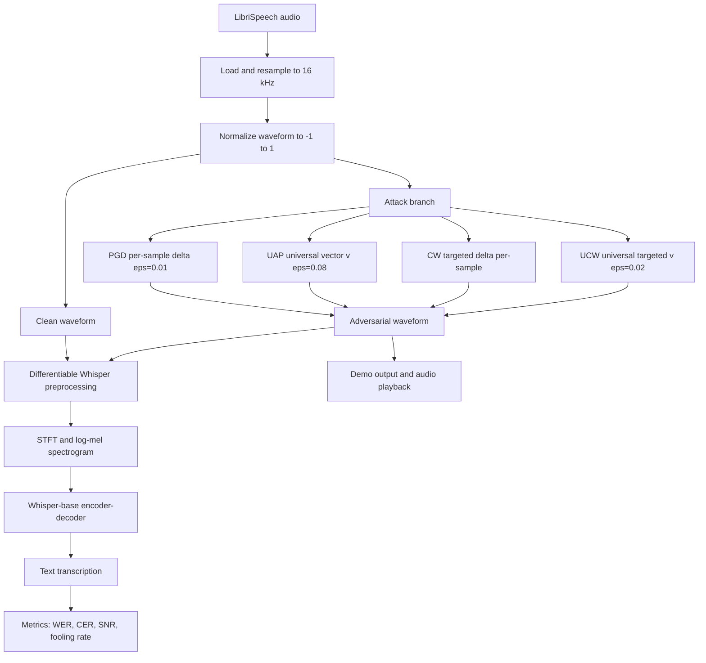

# Audio Adversarial Attacks on Whisper

AAI-590 Capstone Project  
Victor Hugo Germano  
Shiley-Marcos School of Engineering, University of San Diego

This document is written as a PowerPoint-ready technical report. Each top-level section can be used as one slide or a short cluster of slides, and the organization follows the same structure as the written capstone: problem, data, methods, implementation, training, results, evaluation, and conclusion.

## 1. Executive Summary

This project studies whether OpenAI Whisper can be fooled by small, carefully optimized changes to audio that humans may barely notice but that significantly degrade or redirect automatic speech recognition output. The capstone implemented four attack families against Whisper-base:

- Untargeted Projected Gradient Descent (PGD), which creates a custom perturbation for one audio clip at a time.
- Universal Adversarial Perturbation (UAP), which learns one reusable perturbation that can be applied across many audio clips.
- Targeted Carlini-Wagner (CW), which forces Whisper toward a specific phrase on a per-sample basis.
- Universal Carlini-Wagner (UCW), which combines CW's targeted objective with UAP's universal perturbation strategy to force a target phrase across any input audio.

The main finding is that Whisper remains vulnerable in the digital white-box setting across all four attack families. Untargeted attacks substantially change transcription output; the universal untargeted perturbation generalizes to 90% of unseen utterances; targeted per-sample attacks achieve 100% phrase injection on a 5-sample batch; and the universal targeted perturbation achieves a 58.6% success rate on a 350-sample held-out validation set. At the same time, the most successful attacks operate at SNR levels that are more audible than the ideal target, so effectiveness and imperceptibility remain the central tradeoff.

## 2. Problem and Motivation

Automatic speech recognition is increasingly used in voice assistants, transcription systems, accessibility tools, and safety-critical interfaces. That makes adversarial robustness a practical security question, not just an academic one. If an attacker can add a carefully crafted perturbation $\delta$ to clean audio $x$, then the ASR model may produce a degraded or entirely different transcription:

$$
x_{adv} = \operatorname{clip}(x + \delta, -1, 1)
$$

The goal of this project is to test that vulnerability on Whisper and compare four attack modes:

- Untargeted failure: make Whisper transcribe the audio incorrectly.
- Universal untargeted failure: learn one perturbation that works across many inputs.
- Targeted failure: force Whisper to emit a specific phrase.
- Universal targeted failure: force a specific phrase across many inputs with a single perturbation.

This follows the threat model described by Olivier and Raj for Whisper-specific attacks and by Neekhara et al. for universal perturbations in ASR.

## 3. Dataset and Experimental Setup

### Primary dataset

The core dataset is LibriSpeech test-clean, stored locally under [data/LibriSpeech](data/LibriSpeech). It provides clean English read speech with aligned transcripts and is well suited for controlled ASR evaluation.

- Full subset available in the workspace: 2,620 audio files.
- Mean duration from the capstone analysis: 7.42 seconds.
- Maximum duration from the capstone analysis: 34.95 seconds.
- Audio is normalized to Whisper's required 16 kHz domain before attack generation and inference.

### Secondary dataset path

The capstone plan also identifies CommonVoice as a multilingual extension for transfer evaluation, but the recorded results in this repository are centered on LibriSpeech test-clean.

### Evaluation subsets used in the current results

- Clean baseline evaluation: 50 samples (Whisper-small via openai-whisper library).
- PGD batch experiment: 50 samples (Whisper-base via WhisperASRWithAttack).
- UAP training set: 262 samples (10% of 2,620); validation: 20 samples (indices 50–69).
- CW targeted batch experiment: 5 samples (Whisper-base via WhisperASRWithAttack).
- UCW training set: 1,600 samples across 40 speakers; validation: 350 samples across 40 speakers.

### Important baseline caveats

**Punctuation inflation.** Whisper inserts punctuation or slightly normalizes words relative to LibriSpeech transcripts, raising the pre-attack WER floor. The clean baseline recorded in this project is:

- Mean WER: 0.2195 (21.95%)
- Mean CER: 0.0535 (5.35%)

**Model mismatch.** The baseline evaluation notebook uses the OpenAI Whisper "small" variant via the openai-whisper Python library, while all attack notebooks use `WhisperASRWithAttack` wrapping the HuggingFace `openai/whisper-base` checkpoint. Attack results should therefore be interpreted within each experiment rather than compared directly to the baseline WER.

## 4. High-Level ML Pipeline

The project is best understood as an adversarial ML pipeline built around a frozen Whisper model. A single diagram is useful for the presentation.

The key architectural point is that optimization happens in the raw waveform domain, while the actual decision boundary being attacked is the log-mel spectrogram representation Whisper consumes internally.

## 5. Approach and Algorithms

### 5.1 Whisper attack wrapper

The project uses a custom differentiable wrapper around Hugging Face Whisper-base in [src/models/whisper_wrapper.py](src/models/whisper_wrapper.py). Instead of treating preprocessing as a black box, the code manually computes:

- waveform padding or cropping to 30 seconds
- STFT
- mel projection
- Whisper log-mel normalization

That design preserves gradient flow from the loss back to the raw waveform, which is required for all four attacks. All Whisper weights are frozen; only the adversarial perturbation tensor is optimized.

### 5.2 Untargeted PGD

PGD is implemented in [src/attacks/pgd.py](src/attacks/pgd.py). It iteratively updates adversarial audio with signed gradient steps and clamps the result both to the $L_\infty$ perturbation bound and to the valid waveform range:

$$
\delta_{t+1} = \Pi_{\|\delta\|_\infty \le \epsilon}\left(\delta_t + \alpha \cdot \operatorname{sign}(\nabla_x L)\right)
$$

Hyperparameters used in the evaluation: $\epsilon = 0.01$, $\alpha = 0.001$, 20 iterations, random initialization. This is the most direct way to show that even a single utterance can be pushed away from its original transcription.

### 5.3 Universal Adversarial Perturbation

The UAP method is implemented in [src/attacks/uap.py](src/attacks/uap.py) with shared helpers in [src/attacks/base.py](src/attacks/base.py) and [src/attacks/utils.py](src/attacks/utils.py). The perturbation is a single tensor $v$ of shape $[1, 80000]$ (5 seconds at 16 kHz) that is cropped or tiled to match each audio length. The training loop:

- initializes one shared perturbation tensor as zeros
- iterates through a training set of 262 utterances for 20 epochs
- skips examples already fooled by the current perturbation
- updates the shared perturbation with SGD ($\epsilon = 0.08$)
- reprojects the perturbation into the allowed $L_\infty$ ball

Conceptually, this is the most important part of the capstone because it tests whether Whisper has a reusable vulnerability direction rather than only sample-specific weaknesses.

### 5.4 Targeted Carlini-Wagner attack

The targeted attack is implemented in [src/attacks/cw.py](src/attacks/cw.py). It minimizes a joint objective that balances perturbation size and target-phrase loss:

$$
\min_{\delta} \|\delta\|_2^2 + c \cdot L\big(f(x + \delta), y_{target}\big)
$$

The implementation adds three practical features:

- binary search over the constant $c$
- cosine annealing for the optimizer learning rate
- periodic transcription checks with early stopping

This attack is harder and slower than PGD, but it demonstrates the most security-critical scenario because it can inject a chosen phrase rather than merely cause degradation.

### 5.5 Universal Carlini-Wagner Attack

The UCW attack is implemented in [src/attacks/ucw.py](src/attacks/ucw.py) and extends the per-sample CW framework into the universal setting. It trains a single shared perturbation $v$ — the same architecture as the UAP vector — but replaces the untargeted degradation objective with a targeted CW loss:

$$
\min_{v} \; \mathbb{E}_{x \sim X}\left[ \|v\|_2^2 + c \cdot L\big(f(x + \text{tile}(v)),\, y_{target}\big) \right] \quad \text{s.t.} \quad \|v\|_\infty \le \epsilon
$$

This is the most demanding optimization problem in the project. The attack must find a single fixed perturbation that, when tiled or cropped to match any variable-length utterance, causes Whisper to output a specific target phrase regardless of the spoken content. The training loop uses gradient sign steps with a cosine annealing learning rate schedule, gradient accumulation support, and early stopping based on validation success rate. Perturbation is projected back onto the $L_\infty$ $\epsilon$-ball after every step.

Hyperparameters: target phrase "access evil website", $\epsilon = 0.02$, $c = 1.0$, learning rate $5 \times 10^{-4}$, 200 epochs with cosine annealing, gradient accumulation over 4 effective samples, batch size 1. Early stopping is applied when validation success rate shows no improvement for 20 consecutive evaluation checkpoints.

The UCW training used 1,600 training files and 350 validation files from LibriSpeech test-clean across 40 speakers each (split manifest saved in [results/ucw_split_manifest.json](results/ucw_split_manifest.json)), and training was halted early at epoch 66. The trained perturbation is saved at [results/ucw_delta.pt](results/ucw_delta.pt). A working checkpoint used in the demo is saved at [results/ucw_delta_working.pt](results/ucw_delta_working.pt).

## 6. Tools and Software Stack

The implementation uses a practical research stack captured in [requirements.txt](requirements.txt):

- PyTorch for gradients and optimization
- transformers for WhisperForConditionalGeneration (HuggingFace)
- openai-whisper for the baseline evaluation notebook
- librosa and soundfile for audio loading and inspection
- jiwer for WER and CER
- matplotlib for analysis plots
- gradio and resampy for the interactive demo

The core project code is organized under [src](src):

- [src/data/audio_loader.py](src/data/audio_loader.py) for data loading and waveform length normalization
- [src/models/whisper_wrapper.py](src/models/whisper_wrapper.py) for differentiable Whisper inference
- [src/attacks](src/attacks) for PGD, UAP, CW, and UCW implementations

The interactive Gradio demo is implemented in [notebooks/08_train_demo_targeted_attack.ipynb](notebooks/08_train_demo_targeted_attack.ipynb), which loads pre-trained perturbations from the results directory and supports audio file upload and live microphone input.

## 7. Training and Evaluation Protocol

### Training choices

The project follows the practical constraints documented in the capstone notes and AGENTS guidance:

- 16 kHz optimization to match Whisper input expectations
- waveform clamping to the valid range $[-1, 1]$
- primarily sequential, single-sample optimization for memory safety
- direct optimization of perturbations rather than fine-tuning Whisper weights
- `torch.manual_seed(42)` and `np.random.seed(42)` for reproducibility

### Metrics

The project uses four main evaluation metrics:

- Word Error Rate (WER)
- Character Error Rate (CER)
- Signal-to-Noise Ratio (SNR)
- Fooling rate or targeted success rate

SNR is computed in [src/attacks/utils.py](src/attacks/utils.py) as:

$$
\mathrm{SNR}(x, x_{adv}) = 10 \log_{10}\left(\frac{\sum x^2}{\sum (x_{adv} - x)^2}\right)
$$

### Evaluation note

One important reporting detail is that the current notebooks do not use a single identical metric reference across all experiments:

- The clean baseline uses ground-truth transcripts from LibriSpeech.
- The PGD and UAP notebooks mainly evaluate transcription drift between the clean and adversarial Whisper outputs, plus fooling rate and SNR.
- The targeted CW notebook reports both target success and WER against ground truth.

For the presentation, that should be stated explicitly. It does not invalidate the attack results, but it means the numbers should be compared within each experiment setup rather than blindly across all attack families.

## 8. Results

### 8.1 Clean baseline

From [results/baseline_metrics.json](results/baseline_metrics.json) and [notebooks/02_performance_evaluation.ipynb](notebooks/02_performance_evaluation.ipynb):

| Experiment | Samples | Metric | Result |
| --- | ---: | --- | ---: |
| Clean Whisper baseline | 50 | Mean WER vs ground truth | 21.95% |
| Clean Whisper baseline | 50 | Mean CER vs ground truth | 5.35% |

Representative example from [results/baseline_clean_results.json](results/baseline_clean_results.json):

- Ground truth: "they regained their apartment apparently without disturbing the household of gamewell"
- Whisper transcription: "they regain their apartment apparently without disturbing the household of gainwell."

This example shows why punctuation and normalization inflate baseline WER.

### 8.2 Untargeted PGD results

From [notebooks/03_pgd_attack.ipynb](notebooks/03_pgd_attack.ipynb):

| Metric | Result |
| --- | ---: |
| Attack parameters | ε=0.01, α=0.001, 20 iterations |
| Samples evaluated | 50 |
| Attack success rate | 90.0% (45/50) |
| Average transcript-drift WER | 27.55% |
| Average SNR | 19.45 dB |
| SNR range | 15.45 to 22.37 dB |

Interpretation:

- PGD is highly effective at changing Whisper output on a per-sample basis, with 90% of utterances producing a measurably different transcription.
- The achieved SNR of 19.45 dB is below the original ideal imperceptibility goal of 35 to 45 dB, so the current PGD results are strong attacks but not fully stealthy.
- All perturbations respect the $\epsilon = 0.01$ L-infinity constraint, confirming the projection step works correctly.

### 8.3 Universal perturbation results

From [notebooks/04_uap_training.ipynb](notebooks/04_uap_training.ipynb):

| Metric | Result |
| --- | ---: |
| Training set | 262 samples (10% of 2,620), 5s each, ε=0.08 |
| Training epochs | 20 |
| UAP vector length | 80,000 samples (5.0 seconds) |
| Validation set | 20 samples (indices 50–69, held out from training) |
| Fooling rate | 90.00% (18/20 samples) |
| Average transcript-drift WER | 54.70% |
| Average transcript-drift CER | 104.55% |
| Example single-sample SNR | 25.68 dB |

Example from validation:

- Original: "It's been on only two weeks and I've been half a dozen times already."
- Adversarial: "It's not only to reach, but it's time's already."
- SNR: 25.68 dB, WER drift: 78.6%

Interpretation:

- The UAP achieves a 90% fooling rate on the 20-sample validation set, demonstrating strong generalization across unseen utterances trained on only 10% of the full dataset.
- The high average WER (54.70%) and CER (104.55%) reflect genuine transcript disruption: adversarial outputs often bear little lexical resemblance to the original Whisper transcription. CER exceeding 100% is possible with jiwer when the adversarial output contains many spurious insertions relative to a short reference string.
- The UAP is trained only on 10% of the dataset; the remaining 90% of samples serve as an independent generalization check. The saved perturbation is [results/universal_perturbation_v.pt](results/universal_perturbation_v.pt).

### 8.4 Targeted CW results

From [notebooks/05_targeted_attack.ipynb](notebooks/05_targeted_attack.ipynb), using the target phrase "hello world":

| Metric | Result |
| --- | ---: |
| Attack success rate | 100% |
| Mean WER on clean audio | 0.187 |
| Mean WER on adversarial audio | 1.000 |
| Mean SNR | 14.50 dB |

Representative examples from the batch evaluation:

- clean: "among the country population, its place is to some extent ta..." -> adversarial: "hello world" at 18.8 dB
- clean: "first, as a paris stockbroker, later as a celebrated author ..." -> adversarial: "hello world" at 17.0 dB
- clean: "you know captain leak?" -> adversarial: "hello world" at 7.3 dB

Interpretation:

- The targeted attack is the most dramatic failure mode because it replaces meaning, not just accuracy.
- It is also the least stealthy of the recorded experiments, with lower average SNR than PGD and UAP.

### 8.5 Universal Carlini-Wagner results

From [notebooks/06_universal_targeted_attack.ipynb](notebooks/06_universal_targeted_attack.ipynb), targeting the phrase "access evil website":

| Metric | Result |
| --- | ---: |
| Target phrase | "access evil website" |
| Training set | 1,600 samples (40 speakers) |
| Validation set | 350 samples (40 speakers) |
| UAP vector length | 160,000 samples (10.0 seconds) |
| ε (L∞ bound) | 0.02 |
| Training epochs (early stopped) | 66 of 200 |
| Best validation success rate (contains) | ~55% (around epoch 51) |
| Final success\_contains (350 val samples) | 58.6% |
| Final success\_exact (350 val samples) | 56.0% |
| Mean WER vs target phrase | 2.446 |
| Mean CER vs target phrase | 2.202 |
| Mean SNR (dB) | 11.34 |
| δ L∞ | 0.0200 (constraint satisfied) |

Training progression at evaluation checkpoints:

| Checkpoint (epoch) | Train SR | Val SR |
| ---: | ---: | ---: |
| 11 | 85.0% | 35.0% |
| 21 | 75.0% | 40.0% |
| 31 | 80.0% | 50.0% |
| 41 | 85.0% | 45.0% |
| 51 | 75.0% | 55.0% |
| 61 | 90.0% | 50.0% |
| 66 (early stop) | — | — |

Interpretation:

- The UCW attack successfully generalizes targeted phrase injection to 58.6% of held-out utterances using a single fixed perturbation, confirming that universal targeted attacks on Whisper are feasible with sufficient training data and optimization.
- The gap between peak training success (~90%) and final validation success (58.6%) indicates partial overfitting to the training distribution. The perturbation learns directions that generalize broadly but not perfectly.
- The 11.34 dB mean SNR reflects the tight $\epsilon = 0.02$ constraint. The universal optimization trades higher audibility for cross-utterance generalization.
- Training was halted by early stopping at epoch 66 (no validation improvement for 20 epochs), indicating that further training under the current hyperparameters would not improve generalization.
- The validation mean WER vs target (2.446) and CER vs target (2.202) reflect that most adversarial outputs either exactly match the target phrase or are very close to it, with failures typically producing random degraded text rather than partial matches.
- The trained perturbation is saved at [results/ucw_delta.pt](results/ucw_delta.pt). A working checkpoint used in the demo is [results/ucw_delta_working.pt](results/ucw_delta_working.pt).

## 9. Model Throughput and Demo

Because this project is an ML pipeline rather than a model-training-only project, the presentation should include a short throughput demonstration. The repository contains a working Gradio demo implemented in [notebooks/08_train_demo_targeted_attack.ipynb](notebooks/08_train_demo_targeted_attack.ipynb).

The demo:

- loads the targeted perturbation from [results/ucw_delta_working.pt](results/ucw_delta_working.pt)
- loads the untargeted UAP from [results/universal_perturbation_v_80.pt](results/universal_perturbation_v_80.pt)
- loads `openai/whisper-base` via the `WhisperASRWithAttack` wrapper
- supports three modes: Clean, Untargeted UAP, and Targeted CW injection (demo target: "access evil.com")
- accepts audio file uploads and live microphone recording
- auto-resamples any input to 16 kHz and converts stereo to mono
- displays the clean and adversarial transcriptions side by side with computed SNR

The demo also includes a streaming mode that buffers live audio in 1-second chunks, applies silence detection (RMS threshold = 0.01), and finalizes utterances after 1.2 seconds of silence or 14 seconds of continuous speech.

This is best described as an operational throughput demonstration rather than a formal benchmark. It shows that the project is not only an offline notebook study: it supports end-to-end audio capture, perturbation injection, Whisper transcription, and user-visible comparison in a Gradio interface.

For the PowerPoint, a strong slide here would show:

- the live demo architecture
- a screenshot of the Gradio interface
- one clean transcript beside the attacked transcript for the same captured audio

## 10. Evaluation, Risks, and Limitations

### What worked well

- The differentiable Whisper wrapper successfully enabled raw-waveform gradient flow from the loss back to the input signal.
- PGD showed strong per-sample vulnerability at a 90.0% success rate on 50 samples.
- UAP demonstrated that a single reusable perturbation generalizes to 90% of unseen utterances, trained on only 10% of the dataset.
- Per-sample CW confirmed targeted phrase injection is feasible in the white-box setting with 100% success on the evaluation batch.
- UCW demonstrated that a single universal perturbation can force a target phrase on 58.6% of a 350-sample held-out validation set, confirming universal targeted attacks are achievable at this scale.

### What the results mean

- Whisper is vulnerable to optimized digital perturbations even though it is robust to ordinary noise, confirming the core hypothesis of Olivier & Raj (2023).
- Universal perturbations demonstrate a structural vulnerability: the shared attack direction is learnable across diverse speakers, durations, and acoustic content at both the untargeted (90%) and partially targeted (58.6%) levels.
- Targeted attacks represent the most operationally dangerous failure mode because the adversary controls the output meaning, not merely its accuracy.
- The UCW gap (training ~90%, validation 58.6%) provides a quantitative bound on generalization difficulty and shows that further optimization could close this gap.

### Risk description

The threat model throughout this project is a **white-box digital attacker** with full access to the Whisper model weights and the ability to inject an optimized audio perturbation into the pipeline before transcription occurs. Within this threat model, the project surfaces three concrete risk vectors:

1. **Transcription poisoning at scale.** The UAP result shows that a single pre-computed perturbation can degrade the transcription of 90% of utterances across a diverse dataset without any per-sample re-optimization. This is operationally significant for batch transcription pipelines: an attacker who can inject a universal perturbation into a media file or a live stream can erode the reliability of an automated transcription archive without being detected on any individual file.

2. **Phrase injection.** The CW result demonstrates that a 100% success rate for injecting a specific phrase is achievable on a small evaluation batch. If the pipeline downstream of Whisper treats transcription output as trusted input—for example in a voice-command interface, a meeting summarizer, or an LLM prompt router—a targeted perturbation becomes a prompt-injection vector at the audio layer. The phrase need not be audible to a casual listener to be transcribed and executed.

3. **Universal phrase injection.** The UCW experiment demonstrates that a single perturbation can force a specific phrase on 58.6% of diverse held-out utterances. An attacker applying such a perturbation to a streaming pipeline would succeed on more than half of all utterances—sufficient to poison outputs at scale without per-sample tuning. The training success rate of ~90% indicates the ceiling is likely higher with improved optimization.

All three risks are most acute in **fully automated pipelines** where human review of transcriptions does not occur before downstream action is taken.

### Limitations

- **Inflated baseline WER.** Whisper inserts punctuation not present in LibriSpeech ground truth, raising the pre-attack WER floor to 21.95%. Attack results should be read relative to this floor, not as absolute accuracy metrics.
- **Inconsistent evaluation protocol.** PGD and UAP results measure transcript drift from the clean Whisper output; CW results measure success against a target phrase and WER against ground truth. Direct cross-method comparison requires a unified normalization step not yet applied uniformly across all notebooks.
- **SNR below imperceptibility targets.** The ideal goal of SNR $\geq$ 35 dB is not met by the current PGD (19.45 dB), UAP example (25.68 dB), CW (14.50 dB mean), or UCW (11.34 dB mean), limiting real-world stealth.
- **UCW generalization gap.** The universal targeted attack achieves 58.6% validation success compared to ~90% training success, indicating partial overfitting. Closing this gap would require more diverse training data or improved regularization.
- **Digital domain only.** All reported results are in the digital pipeline. Over-the-air attacks involve physical transduction, environmental noise, and microphone characteristics that would likely degrade the perturbation signal and reduce effectiveness.
- **English and single model.** Results are limited to LibriSpeech test-clean English and the Whisper-base checkpoint. Transferability to other languages, larger Whisper variants, or other ASR architectures has not been evaluated.
- **Small CW evaluation batch.** The targeted CW result (5 samples) is too small to draw statistically robust conclusions. Results on a larger held-out set could shift substantially.

## 11. Conclusion

This capstone demonstrates that OpenAI Whisper-base is vulnerable to adversarial perturbations across four distinct attack architectures: per-sample untargeted PGD, dataset-level universal UAP, per-sample targeted CW, and universal targeted UCW. The results establish a clear hierarchy of difficulty and operational significance.

Per-sample attacks are the easiest to optimize: PGD achieves 90% transcript-degradation success and per-sample CW achieves 100% targeted phrase injection. Universal untargeted attacks are harder but highly effective: the UAP trained on only 10% of the dataset achieves a 90% fooling rate on held-out samples, demonstrating a reusable structural vulnerability. Universal targeted attacks are the most demanding but achievable: the UCW attack reaches a 58.6% success rate on 350 held-out validation samples, showing that universal targeted phrase injection is practical in the white-box setting, with a training-to-validation gap (~90% vs 58.6%) that marks where further improvement is possible.

The most practically significant result is the combination of the UAP and UCW findings. A reusable untargeted perturbation that disrupts 90% of all utterances represents a real-world digital jammer. A universal targeted perturbation that injects a specific phrase on more than half of diverse utterances represents a scalable prompt-injection vector at the audio layer—a threat that becomes increasingly relevant as ASR systems serve as the input layer for agentic AI and LLM pipelines.

The SNR limitations (19.45 dB for PGD, 14.50 dB for CW, 11.34 dB for UCW) show that the current attacks trade audibility for effectiveness. Improving imperceptibility while maintaining attack success is the primary engineering challenge for future work.

The project confirms the central claim of Olivier & Raj (2023): Whisper's robustness to ordinary noise does not carry over to adversarial noise. As ASR systems become the transduction layer between human speech and automated decision-making infrastructure, the vulnerabilities documented here—across four distinct attack families ranging from per-sample to universal, untargeted to targeted—represent a category of attack that should be considered by any team deploying Whisper or similar models in security-sensitive, real-time, or agentic contexts.

## 12. Suggested PowerPoint Flow

If this markdown is converted into slides, the most natural order is:

1. Title and project motivation
2. Threat model and why ASR adversarial attacks matter
3. Dataset and baseline Whisper behavior
4. High-level pipeline diagram
5. PGD method and result (90% success, 19.45 dB)
6. UAP method and result (90% fooling rate, 54.70% WER drift)
7. CW targeted method and result (100% success, 14.50 dB mean SNR)
8. UCW universal targeted result (58.6% validation success, 11.34 dB SNR)
9. Demo and throughput slide
10. Evaluation caveats, limitations, and future work
11. Final conclusion and security implications

## References

- Olivier, R., and Raj, B. (2023). Fooling Whisper with adversarial examples. Interspeech 2023.
- Olivier, R., and Raj, B. (2022). There is more than one kind of robustness: Fooling Whisper with adversarial examples.
- Neekhara, P., Hussain, S., Pandey, P., Dubnov, S., McAuley, J., and Koushanfar, F. (2019). Universal adversarial perturbations for speech recognition systems. Interspeech 2019.
- Carlini, N., and Wagner, D. (2018). Audio adversarial examples: Targeted attacks on speech-to-text.

## Answers

### How effective was the machine learning model at learning the task?

This capstone is not a standard supervised training project in which a new model is fit from scratch. Whisper itself remains frozen throughout the experiments, so there is no conventional training accuracy or validation accuracy curve for the ASR model. Instead, the optimization targets are the adversarial perturbations. The closest analogs to learning curves in this project are:

- the UAP training history, which tracks fooling rate and average loss across 20 epochs over 262 training samples
- the UCW notebook, which tracks average loss and train/val success rate over up to 200 epochs on 1,600 training samples

The untargeted UAP results show strong learning. The training notebook records a 20-epoch optimization run over 262 training samples, and the saved plot explicitly tracks increasing fooling rate alongside changing loss. The validation snapshot shows a 90.0% fooling rate on 20 held-out samples, with 54.70% average transcript-drift WER and 104.55% CER. That pattern demonstrates the perturbation successfully learned a generalizable attack direction that works across unseen utterances.

The UCW results show meaningful but partial generalization. In [notebooks/06_universal_targeted_attack.ipynb](notebooks/06_universal_targeted_attack.ipynb), the training success rate rises as high as 90% by epoch 61 while the average loss decreases substantially. Post-training evaluation on the 350-sample validation set shows 58.6% contains-success and 56.0% exact-match success. The gap between peak training success (~90%) and validation success (58.6%) indicates partial overfitting to the training distribution, but the perturbation still generalizes to more than half of unseen utterances. Training was halted by early stopping at epoch 66. The 11.34 dB mean SNR reflects the tight $\epsilon = 0.02$ constraint.

For PGD and single-sample CW, overfitting is not the right frame because those attacks are intentionally optimized per utterance. Their high success rates (90% and 100% respectively) demonstrate that per-sample optimization is strong, but they do not represent generalization in the same sense as UAP or UCW.

### What evidence supports or disproves the research hypothesis?

The central research question is whether Whisper is vulnerable to adversarial perturbations, especially reusable universal perturbations, in a digital white-box setting. The evidence broadly supports that hypothesis, with important qualifications about imperceptibility and the harder universal targeted setting.

Evidence supporting the hypothesis:

- Clean baseline performance establishes a meaningful reference: 21.95% WER and 5.35% CER on the chosen subset.
- Untargeted PGD changes the transcription on 90.0% of evaluated samples, showing strong per-sample vulnerability.
- The untargeted UAP reaches a 90% fooling rate on held-out samples, confirming that a shared perturbation generalizes across diverse utterances with high reliability.
- Per-sample CW achieves 100% targeted success on the 5-sample evaluation batch, confirming phrase injection is feasible in this white-box regime.
- The UCW experiment achieves 58.6% validation success on 350 held-out samples, confirming that universal targeted generalization is achievable with sufficient training.

Evidence that qualifies the hypothesis:

- The most successful attacks do not yet operate in the ideal 35–45 dB SNR range. PGD averages 19.45 dB, per-sample CW averages 14.50 dB, and UCW averages 11.34 dB, meaning the attacks are effective but more audible than desired.
- UCW validation success (58.6%) is meaningfully lower than training success (~90%), showing that the universal targeted problem is not yet saturated at the current scale and hyperparameters.

Taken together, the project strongly supports the claim that Whisper is attackable across all four attack families, strongly supports universal untargeted vulnerability, and provides meaningful positive evidence that universal targeted attacks are practical in the white-box setting.

### How does model performance affect the application of the model to the problem?

For this capstone, the practical problem is ASR security and trustworthiness. Model performance directly affects how serious the risk is.

The PGD and CW results show that a capable white-box attacker can degrade or redirect Whisper outputs very effectively. That means any downstream application that assumes transcription fidelity, such as command interpretation, automated moderation, searchable meeting notes, or voice-based workflows, can be compromised if adversarial audio enters the pipeline.

The UAP result is especially important from an application perspective because it is reusable. A 90% fooling rate means that a pre-computed universal perturbation can disrupt batch transcription archives without requiring any per-sample optimization. This makes the attack operationally feasible for a jammer-style scenario.

The UCW result extends this risk to the targeted setting. A single perturbation that forces a specific phrase on 58.6% of diverse held-out utterances represents a scalable prompt-injection vector. The phrase need not be audible to a casual listener to be transcribed and executed.

The lower-than-desired SNR values limit immediate real-world stealth, especially for the targeted attacks. The current performance implies real vulnerabilities in digital pipelines, batch transcription settings, and controlled demos, but not yet fully covert attacks under realistic human listening conditions.

### What is the user experience of the complete machine learning system?

The repository includes a full interactive demo path through [notebooks/08_train_demo_targeted_attack.ipynb](notebooks/08_train_demo_targeted_attack.ipynb). The intended user experience is:

- choose a mode: Clean, Untargeted UAP, or Targeted CW injection
- upload an audio file or record a microphone segment
- run Whisper-base on the clean or perturbed audio
- compare the resulting transcriptions and view the computed SNR

From a system perspective, the demo proves that the project is more than an offline notebook study. It supports real audio capture at any sample rate (auto-resampled to 16 kHz), perturbation application, and visible transcription changes through a Gradio interface.

There are practical rough edges:

- Whisper inference adds latency after capture, so the demo is not truly real-time.
- The streaming mode uses a 1-second chunk buffer with silence detection and finalizes utterances after 1.2 seconds of silence or 14 seconds of continuous speech.
- The targeted mode depends on the saved perturbation file at [results/ucw_delta_working.pt](results/ucw_delta_working.pt); if that file is missing the demo falls back to an error message.
- The current UI is prototype quality and may require cleanup before polished presentation use.

In common use cases, the system demonstrates the attack concept effectively with clear side-by-side transcription comparisons.

## Future Work

### 1. Closing the UCW generalization gap

The UCW experiment reaches 58.6% validation success compared to ~90% training success. Closing this gap is the most actionable improvement target. The training success rate confirms the CW objective is differentiable and learnable in the universal setting; the training-to-validation gap points to an overfitting or diversity problem. Specific next steps:

- **Curriculum training**: start with the easiest-to-fool samples and gradually include harder ones rather than sampling uniformly, to prevent early overfitting to a narrow cluster of utterances.
- **Perceptual loss augmentation**: add a psychoacoustic penalty (e.g., Qin et al.'s imperceptibility loss based on the SII model) to the CW objective so the optimizer is discouraged from relying on narrow high-energy frequency bands that correlate with the training corpus but do not generalize.
- **Larger training sets**: the current training split is 1,600 files. Scaling to the full 2,620-file test-clean set or incorporating a train-clean split would directly address the diversity gap.
- **Warm-starting from the UAP checkpoint**: the saved untargeted universal perturbation in [results/universal_perturbation_v.pt](results/universal_perturbation_v.pt) already captures a direction that generalizes across the dataset. Initializing UCW from that checkpoint rather than random noise may accelerate convergence toward a generalizing targeted direction.

### 2. Improving imperceptibility across all attack families

None of the current attack results meet the original 35–45 dB imperceptibility target at full effectiveness. PGD averages 19.45 dB and per-sample CW averages 14.50 dB. Targeted improvement strategies:

- **Perceptually-weighted $\epsilon$ schedules**: rather than a flat $L_\infty$ bound, use a frequency-dependent constraint that allows larger perturbations in frequency bands where human hearing is less sensitive (e.g., above 8 kHz for speech).
- **SNR-constrained reporting**: report results at fixed SNR budgets (30, 35, 40, 45 dB) by re-running attacks with smaller $\epsilon$ and more iterations, following the design described in the training protocol section but not yet fully executed across all attack families.
- **Adversarial audio quality metrics**: replace squared $L_2$ with PESQ or STOI-based loss terms to optimize directly for perceptual similarity rather than mean-squared waveform distance.

### 3. Standardizing evaluation

A single unified evaluation protocol would make cross-method comparison valid. Required steps:

- Apply text normalization (lowercase, strip punctuation) uniformly before computing WER and CER for all experiments.
- Report all attack results against LibriSpeech ground-truth transcripts rather than against the clean Whisper output, so all fooling rates are on a common reference.
- Expand evaluation batch sizes: CW should be evaluated on at least 50 samples and UAP on at least 100 to produce statistically stable estimates.

### 4. Transferability and physical realism

All current results operate in the digital domain with direct tensor injection. Operationally meaningful attacks require:

- **Over-the-air evaluation**: play adversarial audio through a speaker and record it with a microphone before passing to Whisper. Room impulse response and microphone frequency response will distort the perturbation; the key question is how much SNR budget is lost in transduction.
- **Transfer to larger Whisper variants**: test whether perturbations optimized against Whisper-base transfer to Whisper-small, Whisper-medium, or Whisper-large without re-optimization, which would indicate architecture-independent vulnerability directions.
- **Multilingual evaluation**: test the universal perturbation on CommonVoice non-English subsets to determine whether the attack direction is language-dependent or exploits language-agnostic spectrogram features.
- **Black-box transfer**: evaluate whether perturbations transfer to wav2vec 2.0 or other Transformer-based ASR architectures to assess whether the structural vulnerability is Whisper-specific.