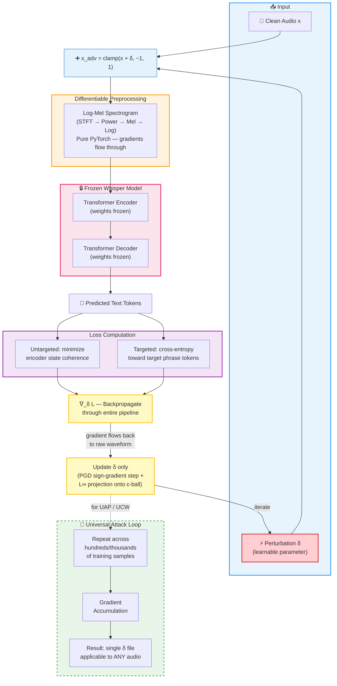

# Adversarial Perturbation Pipeline on Whisper ASR

```mermaid
flowchart TB
    subgraph INPUT["📥 Input"]
        A["🎤 Clean Audio x"]
        D["⚡ Perturbation δ\n(learnable parameter)"]
    end

    ADD["➕ x_adv = clamp(x + δ, −1, 1)"]

    subgraph DIFF["Differentiable Preprocessing"]
        MEL["Log-Mel Spectrogram\n(STFT → Power → Mel → Log)\nPure PyTorch — gradients flow through"]
    end

    subgraph WHISPER["🔒 Frozen Whisper Model"]
        direction TB
        ENC["Transformer Encoder\n(weights frozen)"]
        DEC["Transformer Decoder\n(weights frozen)"]
        ENC --> DEC
    end

    OUT["📝 Predicted Text Tokens"]

    subgraph LOSS_BLOCK["Loss Computation"]
        LOSS_U["Untargeted: minimize\nencoder state coherence"]
        LOSS_T["Targeted: cross-entropy\ntoward target phrase tokens"]
    end

    GRAD["∇_δ L — Backpropagate\nthrough entire pipeline"]

    UPDATE["Update δ only\n(PGD sign-gradient step +\nL∞ projection onto ε-ball)"]

    A --> ADD
    D --> ADD
    ADD --> MEL
    MEL --> ENC
    DEC --> OUT
    OUT --> LOSS_U
    OUT --> LOSS_T
    LOSS_U --> GRAD
    LOSS_T --> GRAD
    GRAD -->|"gradient flows back\nto raw waveform"| UPDATE
    UPDATE -->|"iterate"| D

    subgraph UNIVERSAL["🔄 Universal Attack Loop"]
        direction LR
        SAMPLES["Repeat across\nhundreds/thousands\nof training samples"]
        ACCUM["Gradient\nAccumulation"]
        SINGLE["Result: single δ file\napplicable to ANY audio"]
        SAMPLES --> ACCUM --> SINGLE
    end

    UPDATE -.->|"for UAP / UCW"| SAMPLES

    style INPUT fill:#e8f4fd,stroke:#2196F3,stroke-width:2px
    style DIFF fill:#fff3e0,stroke:#FF9800,stroke-width:2px
    style WHISPER fill:#fce4ec,stroke:#E91E63,stroke-width:2px
    style LOSS_BLOCK fill:#f3e5f5,stroke:#9C27B0,stroke-width:2px
    style UNIVERSAL fill:#e8f5e9,stroke:#4CAF50,stroke-width:2px,stroke-dasharray: 5 5
    style GRAD fill:#fff9c4,stroke:#FFC107,stroke-width:2px
    style UPDATE fill:#fff9c4,stroke:#FFC107,stroke-width:2px
    style ADD fill:#e3f2fd,stroke:#1976D2,stroke-width:1px
    style D fill:#ffcdd2,stroke:#D32F2F,stroke-width:2px
```
