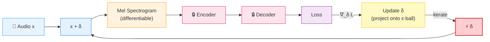

# Adversarial Perturbation Pipeline

```mermaid
flowchart LR
    A["🎤 Audio x"] --> ADD["x + δ"]
    D["⚡ δ"] --> ADD
    ADD --> MEL["Mel Spectrogram\n(differentiable)"]
    MEL --> ENC["🔒 Encoder"]
    ENC --> DEC["🔒 Decoder"]
    DEC --> LOSS["Loss"]
    LOSS -->|"∇_δ L"| UPDATE["Update δ\n(project onto ε-ball)"]
    UPDATE -->|"iterate"| D

    style A fill:#e8f4fd,stroke:#2196F3
    style D fill:#ffcdd2,stroke:#D32F2F,stroke-width:2px
    style ADD fill:#e3f2fd,stroke:#1976D2
    style MEL fill:#fff3e0,stroke:#FF9800
    style ENC fill:#fce4ec,stroke:#E91E63
    style DEC fill:#fce4ec,stroke:#E91E63
    style LOSS fill:#f3e5f5,stroke:#9C27B0
    style UPDATE fill:#fff9c4,stroke:#FFC107
```
